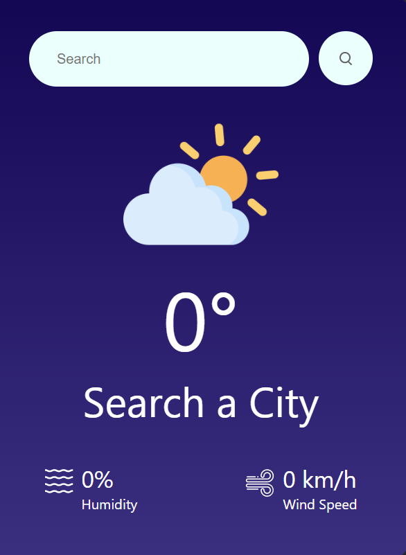
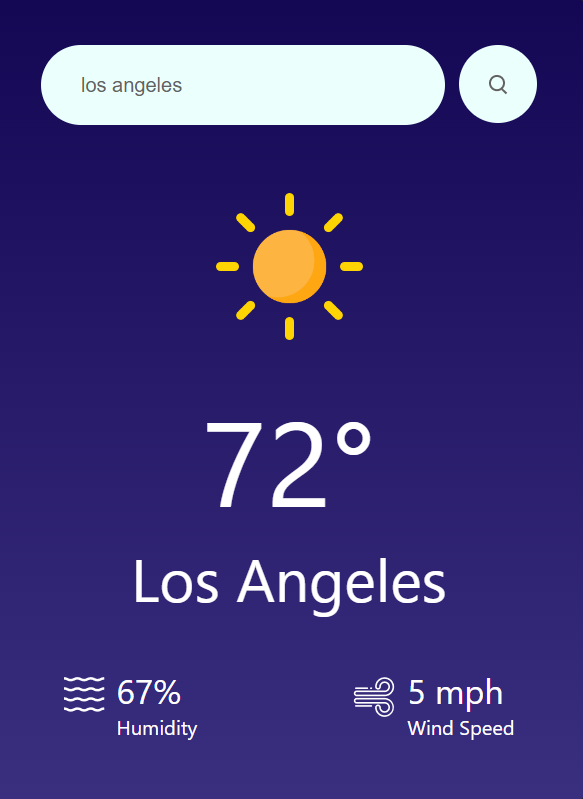
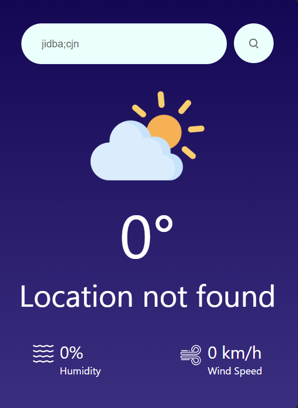

# Weather App

This project was built using React. I built this project to practice making a UI and interfacing with an API. This application uses the OpenWeatherMap API (https://openweathermap.org/) to search the current weather for a given city.
This is the screen on loading the application:
---

 
The user can input a city and the application will call the API and populate the weather data into the page.
---

 
If the user inputs an unrecognized city, the application will display "Location not found".
---

